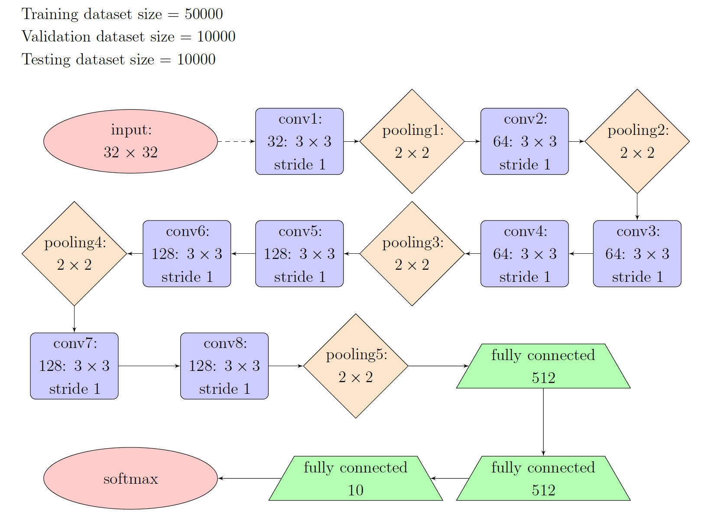
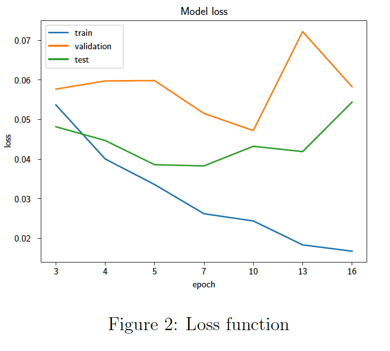
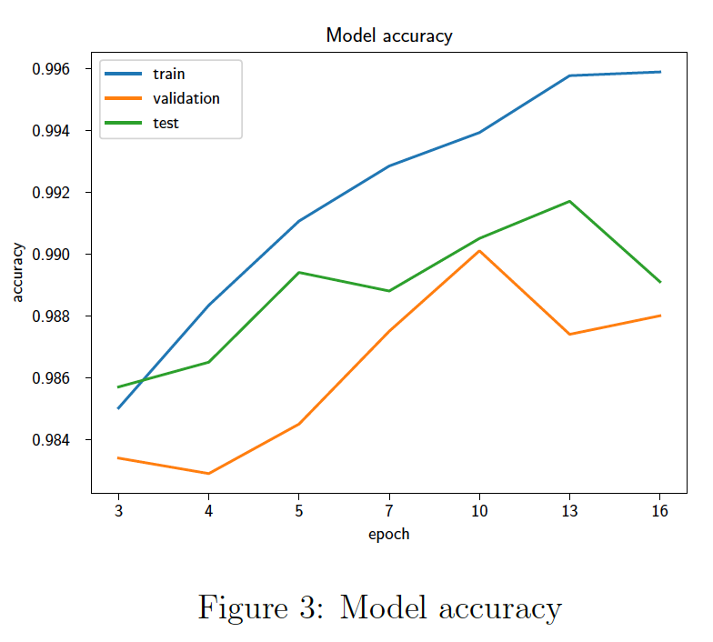
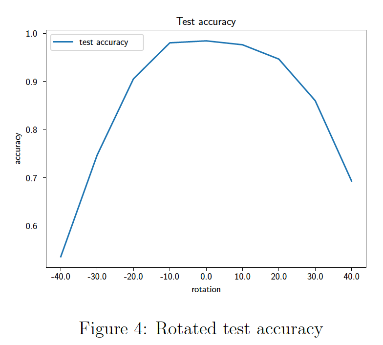
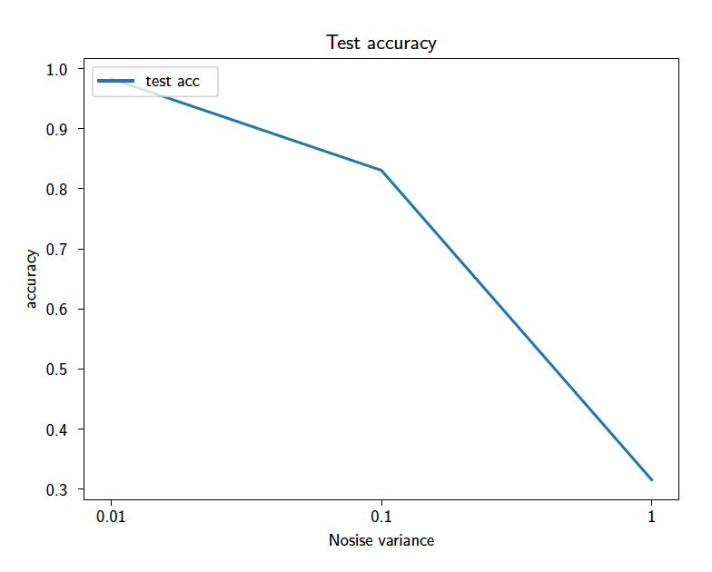
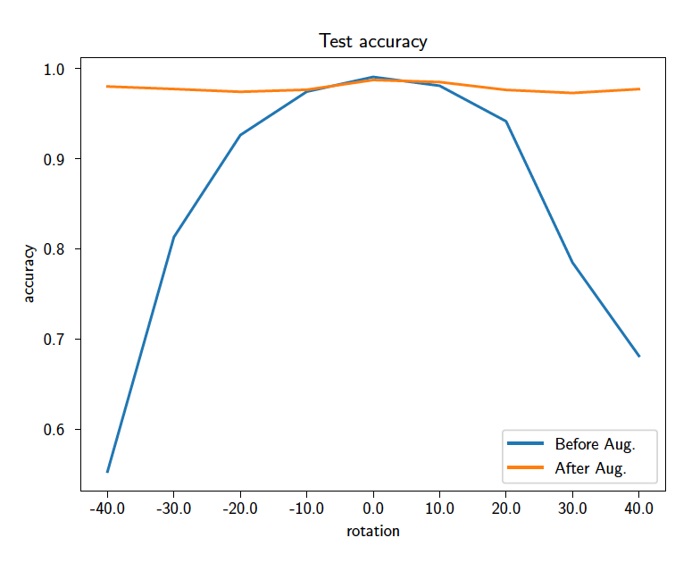
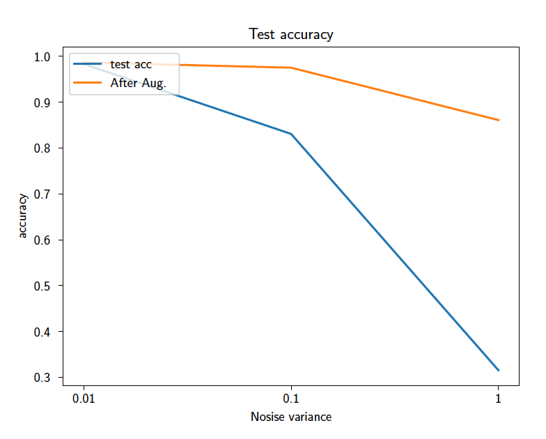
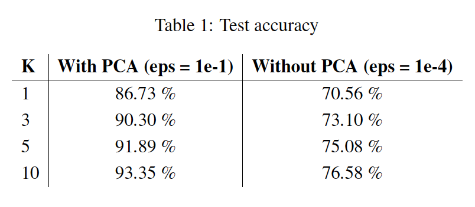

# MNIST Classification Projects for CS 480/680 Fall 2019 (UWaterloo)

- Fine-tunning VGG11 model with MNIST
  - Training VGG11 model with MNIST
  
  
  - Inspecting the training process
    - Loss function vsepoch
    
    - Accuracy vs epoch
    
    
  - Inspecting the generalization properties
    - Test accuracy vs the degree of rotation
    
    - Test accuracy vs Gaussian noise
    
  - Data augmentation using rotation and adding Gaussian noise
    - Test accuracy vs the degree of rotation after data augmentation
    
    - Test accuracy vs Gaussian noise after data augmentation
    
    
- Bayes Gaussian Mixture Models (GMM)
  - Fitting Data set into K Gaussian Models
  - Inspecting impact of PCA
  
  
